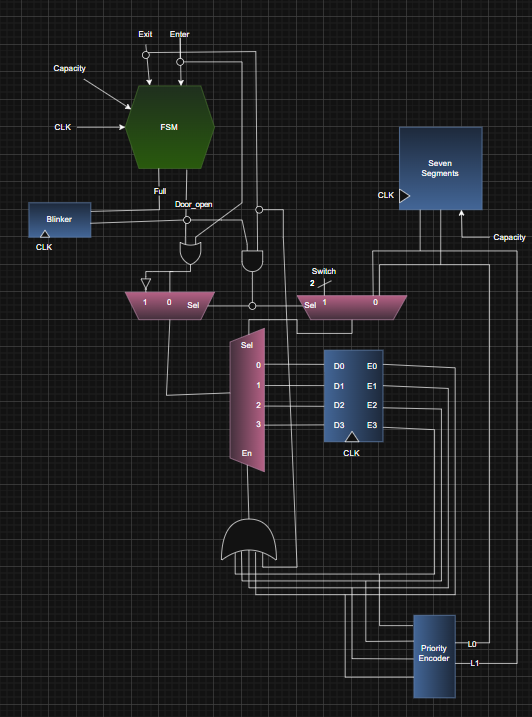
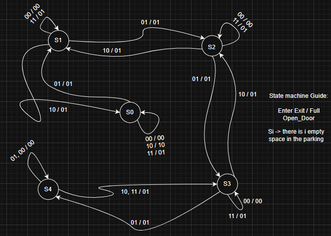

# Smart Parking Lot System

A compact and efficient **Smart Parking Lot** system designed for FPGA implementation as final project of digital circuit course at AmirKabir university. This project provides automated suggestions for the best (nearest) parking spot and incorporates visual feedback using LED indicators and a seven-segment display for a seamless user experience.

## Key Features

- **Nearest Spot Recommendation**  
  The system suggests the closest available parking spot dynamically.

- **Full Capacity Alert**  
  A bright light indicator (behind the door) blinks when all parking spaces are full and new vehicle tries to enter.

- **Parking Status Display**  
  A seven-segment display shows real-time information about parking availability and slot assignments.

- **Hardware Implementation**  
  Designed for an FPGA board.

## How It Works

1. **Spot Detection**:  
   Sensors detect the availability of each parking space.

2. **Nearest Spot Allocation**:  
   The system automatically recommends and reserves the nearest available spot for incoming vehicles.

3. **Full Lot Indicator**:  
   When all four parking spaces are occupied, an LED light positioned behind the entry door blinks to notify users.

4. **Dynamic Display**:  
   Real-time parking information is displayed on a seven-segment display for enhanced user experience.

## Project architecture

## State diagram

